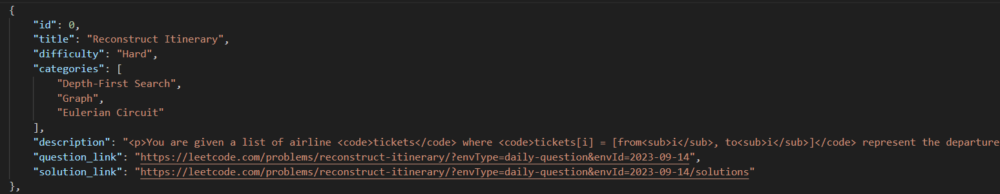

## LeetCode Questions Dataset

### Overview

This repository contains a comprehensive dataset of over 2.7k LeetCode questions, scraped and compiled in raw HTML format. Each question is presented in the perfect styling as found on the LeetCode platform. This dataset can be a valuable resource for developers interested in building mock applications or exploring various programming challenges.

### Dataset Information

- **File**: `leetcode_questions.json`
- **Format**: JSON
- **Questions Count**: 2,700+
- **Size**: Approximately 5.4 megabytes
- **Styling**: Raw HTML (similar to LeetCode)

### Usage

This dataset can be utilized for a variety of purposes, including:

- **Mock Applications**: Use the data to build mock applications simulating the LeetCode environment.
  
- **Algorithm Exploration**: Analyze and explore various algorithms and problem-solving techniques represented in the LeetCode questions.

- **Educational Purposes**: Ideal for creating educational content, tutorials, and courses focused on coding challenges.

### Getting Started

1. **Clone the Repository:**
   ```bash
   gh repo clone imrajsinghsandhu/leetcode-questions
   ```

2. **Access the Data:**
   The dataset is stored in the `leetcode_questions.json` file. You can load and parse this JSON file in your preferred programming language for further exploration.

3. **Incorporate in Your Project:**
   Integrate the LeetCode questions into your project to enhance your exploration journey in developing applications.

### Example (Python):

```python
import json

# Load the dataset
with open('leetcode_questions.json', 'r') as file:
    leetcode_data = json.load(file)

# Access individual questions
for question in leetcode_data:
    print(question['title'])
    print(question['description'])
    # Additional fields like difficulty, tags, etc., are also available
    print(f"Difficulty: {question['difficulty']}")
    print(f"Tags: {question['tags']}")
    print("\n")
```

### Example Questions


1. **Reconstruct Itinerary**
   - **Difficulty**: Hard
   - **Categories**: Depth-First Search, Graph, Eulerian Circuit
   - [Question Link](https://leetcode.com/problems/reconstruct-itinerary/?envType=daily-question&envId=2023-09-14)
   - [Solution Link](https://leetcode.com/problems/reconstruct-itinerary/?envType=daily-question&envId=2023-09-14/solutions)

   Description:
   ```
   You are given a list of airline tickets where tickets[i] = [from_i, to_i] represent the departure and the arrival airports of one flight. Reconstruct the itinerary in order and return it.
   ```

2. **Two Sum**
   - **Difficulty**: Easy
   - **Categories**: Array, Hash Table
   - [Question Link](https://leetcode.com/problems/two-sum)
   - [Solution Link](https://leetcode.com/problems/two-sum/solutions)

   Description:
   ```
   Given an array of integers nums and an integer target, return indices of the two numbers such that they add up to target.
   ```

### Contribution

If you find any issues with the dataset or have suggestions for improvement, feel free to open an issue or submit a pull request. Contributions are welcome!

### Disclaimer

This dataset is for educational and exploratory purposes only. LeetCode is a registered trademark of LeetCode, Inc. This repository is not affiliated with or endorsed by LeetCode.
Happy coding! 🚀